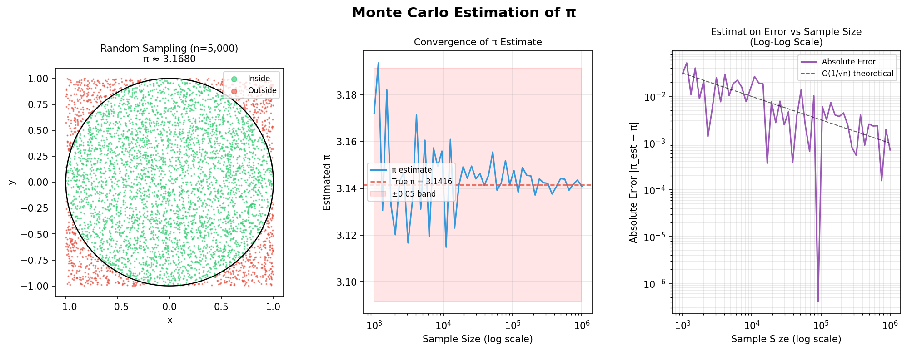

# Monte Carlo Simulation Visualizer

Estimating π using random sampling and visualizing how the estimate converges as sample size grows from 1,000 to 1,000,000.



---

## What is this?

This project uses the **Monte Carlo method** to estimate the value of π (3.14159...) without any formula just random numbers and geometry.

The idea is simple:

1. Imagine a circle perfectly fitted inside a square
2. Throw thousands of random points at the square
3. Count how many land inside the circle
4. The ratio of inside points to total points is always π/4

```
π ≈ 4 × (points inside circle / total points)
```

The more points you throw, the closer your estimate gets to the true value of π.

---

## Why does this matter?

Monte Carlo is not just a math trick. It's a real technique used in:

- **Quantitative Finance** — pricing derivatives, estimating portfolio risk
- **Physics** — simulating particle behavior
- **AI/ML** — reinforcement learning, probabilistic inference
- **Computer Graphics** — realistic light rendering (ray tracing)

This project implements it on a simple, provable problem so the behavior is easy to observe and measure.

---

## What this project does

### 1. Runs the simulation at scale
Simulates random sampling at 50 different sample sizes  from n=1,000 to n=1,000,000  and records the π estimate and error at each step.

### 2. Produces 3 visualizations

**Plot 1 — Random Sampling Scatter**
Shows 5,000 random points plotted on a square. Green points landed inside the unit circle, red points outside. The ratio of green to total visually demonstrates why this works.

**Plot 2 — Convergence of the Estimate**
As sample size grows, the π estimate homes in on the true value. Plots the estimate on a log scale against true π to show convergence behavior.

**Plot 3 — Estimation Error (Log-Log Scale)**
The most technically interesting plot. On a log-log scale, the error follows a straight line with slope −0.5 — proving that Monte Carlo error follows **O(1/√n)**. This is the Central Limit Theorem made visible.

> To halve your estimation error, you need 4× the samples. That's the fundamental trade-off of Monte Carlo methods.

---

## Sample Output

```
n=     1,000  →  π ≈ 3.148000  |  error = 0.006407
n=    10,000  →  π ≈ 3.139200  |  error = 0.002393
n=   100,000  →  π ≈ 3.142680  |  error = 0.001087
n= 1,000,000  →  π ≈ 3.141220  |  error = 0.000373
```

Error drops roughly 10× for every 100× increase in sample size ,consistent with O(1/√n) convergence.

---

## Setup

**Requirements**
```
Python 3.7+
numpy
matplotlib
```

**Install dependencies**
```bash
pip install numpy matplotlib
```

**Run**
```bash
python main.py
```

The script will print convergence data to the terminal and save `monte_carlo_results.png` in the same directory.

---

## Project Structure

```
monte_carlo/
├── main.py          # Main simulation and visualization
├── monte_carlo_results.png # Output plot (generated on run)
└── README.md
```

---

## Key Concept

Monte Carlo convergence rate is **O(1/√n)**.

This means the method is not chosen for precision, it's chosen when the problem is too complex to solve analytically. In finance, physics, and AI, the problems are often exactly that complex.

---

## Tech Stack

- **Python** — core simulation logic
- **NumPy** — vectorized random sampling and math
- **Matplotlib** — all three visualizations
